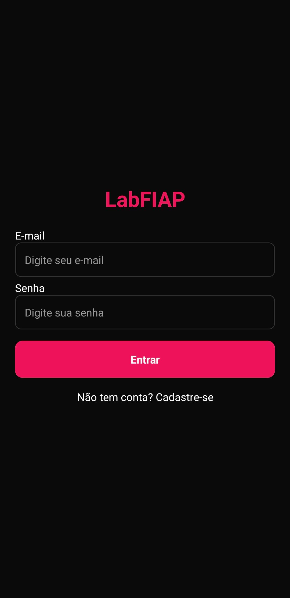
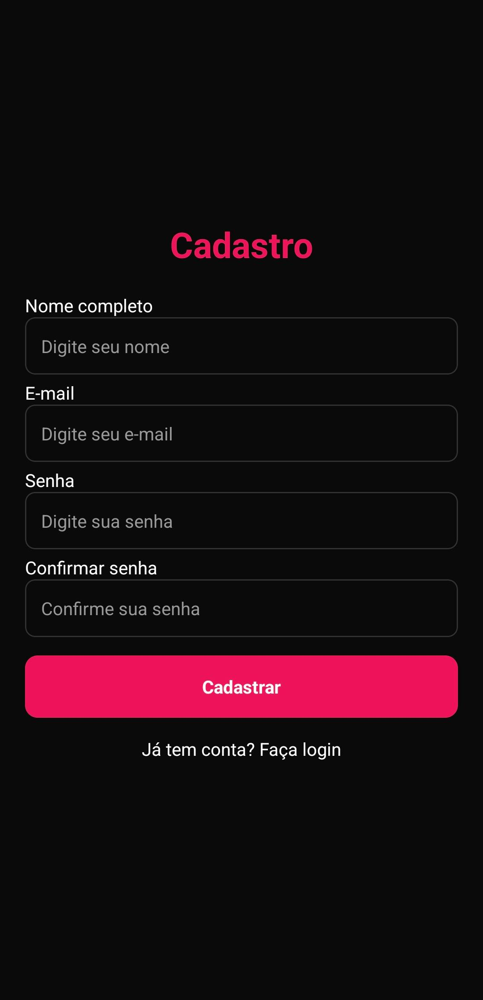
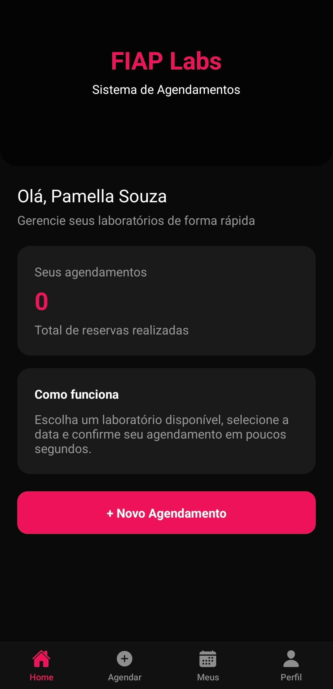
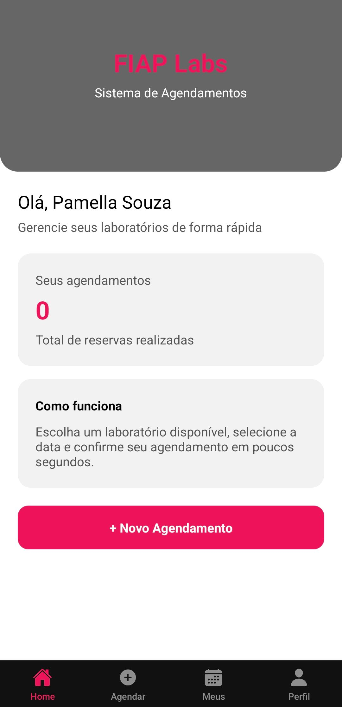
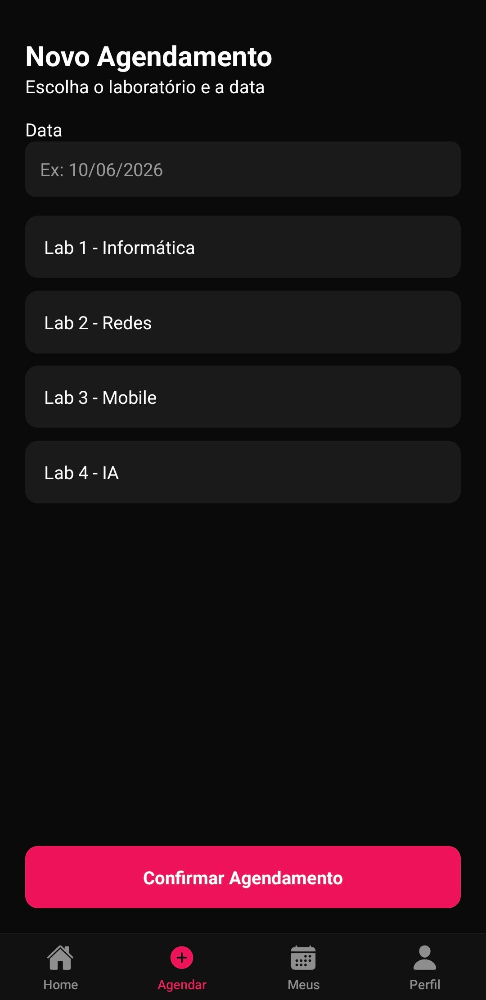
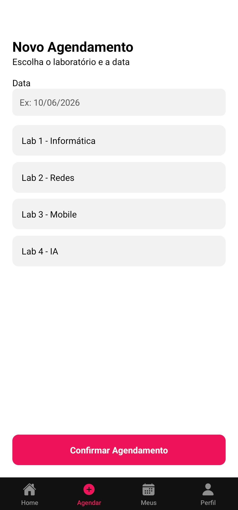
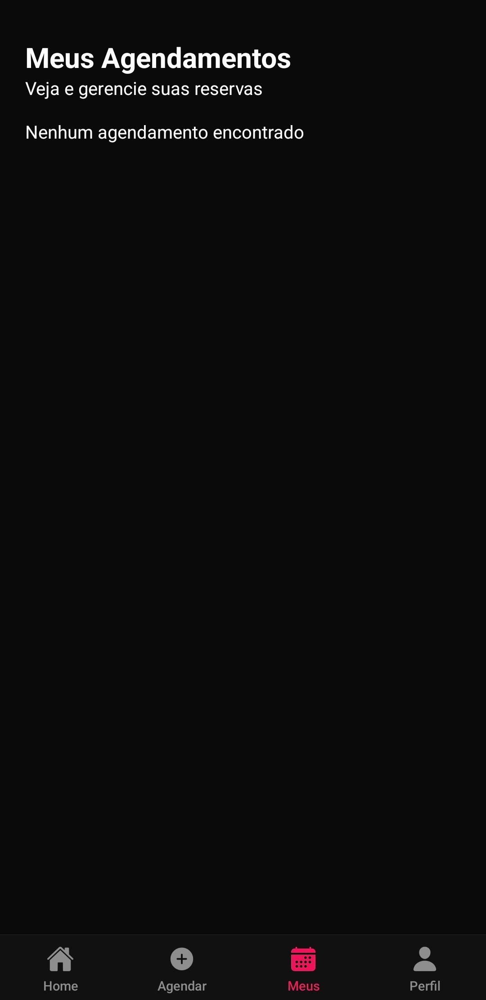
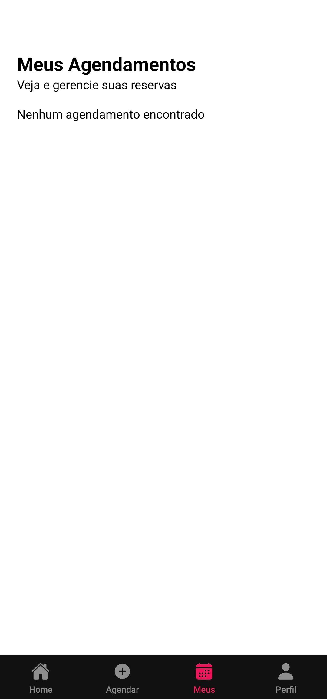
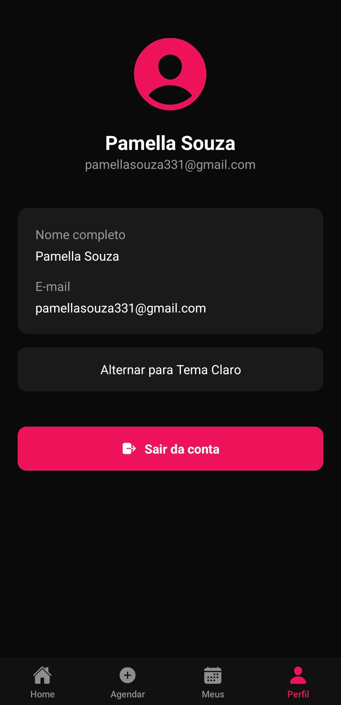
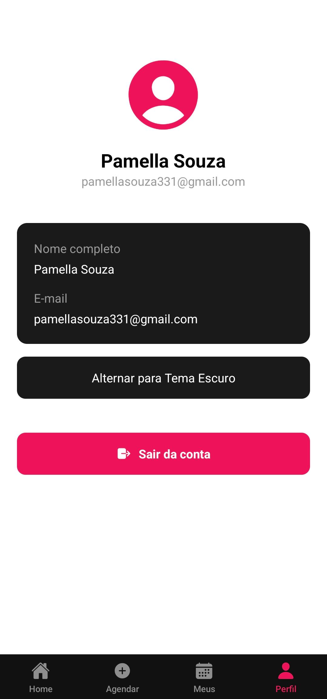

# 📱 FIAP Labs

## 📱 Sobre o Projeto

O FIAP Labs é um aplicativo mobile desenvolvido para facilitar o agendamento de laboratórios dentro da FIAP.

O problema identificado foi a ausência de um sistema digital simples e acessível para reserva de laboratórios, o que pode gerar desorganização e dificuldade de uso.

O aplicativo permite que o usuário:
- Realize cadastro e login
- Visualize seus agendamentos
- Crie novos agendamentos
- Exclua reservas existentes
- Alterne entre tema claro e escuro

---

## 🔄 Evolução do CP1 → CP2

No CP2, o projeto foi aprimorado com:

* Autenticação de usuários
* Persistência de dados com AsyncStorage
* Estado global com Context API
* Validação de formulários
* Melhorias de UI/UX
* Tema claro/escuro (diferencial)

---

## ⚙️ Funcionalidades

* Cadastro de usuário
* Login com validação
* Persistência de sessão
* Criação de agendamentos
* Listagem de agendamentos
* Exclusão de agendamentos
* Busca de laboratórios
* Tema claro/escuro
* Logout

---

## 👥 Integrantes

* Pamella Souza da Silva Ferreira — RM: 566172 2CCPH

---

## ▶️ Como Rodar o Projeto

### Pré-requisitos

* Node.js
* Expo CLI
* Expo Go

### Passo a passo

```bash
git clone https://github.com/SEU-USUARIO/fiap-cpad-cp2-fiap-labs
cd fiap-cpad-cp2-fiap-labs
npm install
npx expo start
```

---

## 📸 Demonstração

### 📸 Imagens

## 📸 Demonstração Visual

<table>
  <tr>
    <td align="center">
      <b>Login</b><br>
      
    </td>
    <td align="center">
      <b>Cadastro</b><br>
      
    </td>
    <td align="center">
      <b>Home Dark</b><br>
      
    </td>
    <td align="center">
      <b>Home Light</b><br>
      
    </td>
  </tr>

  <tr>
    <td align="center">
      <b>Agendamentos Dark</b><br>
      
    </td>
    <td align="center">
      <b>Agendamentos Light</b><br>
      
    </td>
    <td align="center">
      <b>Meus Agendamentos Dark</b><br>
      
    </td>
    <td align="center">
      <b>Meus Agendamentos Light</b><br>
      
    </td>
  </tr>

  <tr>
    <td align="center">
      <b>Perfil Dark</b><br>
      
    </td>
    <td align="center">
      <b>Perfil Light</b><br>
      
    </td>
  </tr>
</table>

---

### 🎥 Vídeo

Assista ao vídeo demonstrativo:

👉 https://youtube.com/shorts/PprxTJ4Kq6Q?feature=share

---

## 🧠 Decisões Técnicas

O projeto foi estruturado utilizando o Expo Router, organizando as rotas em duas principais áreas: autenticação (`(auth)`) e aplicação principal (`(tabs)`), garantindo separação clara de responsabilidades e melhor manutenção do código.

A aplicação utiliza dois Contexts principais:

- **AuthContext**: responsável por gerenciar autenticação do usuário, incluindo login, cadastro, logout e persistência de sessão com AsyncStorage.
- **AppDataContext**: responsável pelo gerenciamento dos agendamentos (criação, listagem e exclusão), garantindo persistência dos dados localmente.

A persistência foi implementada com AsyncStorage, armazenando:
- Dados do usuário (`user`)
- Sessão ativa (`loggedUser`)
- Lista de agendamentos (`agendamentos`)

A navegação protegida foi implementada no arquivo `app/index.jsx`, redirecionando usuários não autenticados para a tela de login, impedindo acesso indevido às telas internas.

Foram utilizados os hooks:
- `useState` para controle de estados locais
- `useEffect` para carregamento inicial de dados persistidos
- `useContext` para acesso ao estado global

A estilização foi feita com StyleSheet e uso de tema dinâmico, garantindo consistência visual e adaptação entre modo claro e escuro.

## 🔐 Autenticação

A autenticação foi implementada utilizando AsyncStorage para simular um sistema de persistência local.

O fluxo funciona da seguinte forma:
- O usuário realiza cadastro com validação de campos obrigatórios
- Os dados são armazenados localmente
- No login, as credenciais são validadas com os dados persistidos
- Após login bem-sucedido, o usuário é redirecionado para a aplicação
- A sessão é mantida mesmo após fechar o app
- O logout remove os dados da sessão e redireciona para login


### Navegação protegida

Usuário não autenticado é redirecionado para login.

---

## ⭐ Diferencial Implementado: Tema Dinâmico (Dark/Light Mode)

Foi implementado um sistema de tema dinâmico utilizando Context API, permitindo ao usuário alternar entre modo claro e escuro diretamente pela tela de perfil.

### Justificativa
Esse diferencial foi escolhido para melhorar a experiência do usuário, permitindo adaptação visual de acordo com preferência pessoal e condições de uso (ex: ambientes escuros).

### Implementação
Foi criado um `ThemeContext` responsável por:
- Armazenar o tema atual
- Alternar entre modo claro e escuro
- Aplicar estilos dinamicamente em todas as telas

Todas as telas consomem esse contexto, garantindo atualização imediata da interface ao alterar o tema.

---

## 🔮 Próximos Passos

* Integração com API real
* Notificações de agendamento
* Upload de foto de perfil
* Edição de agendamentos
